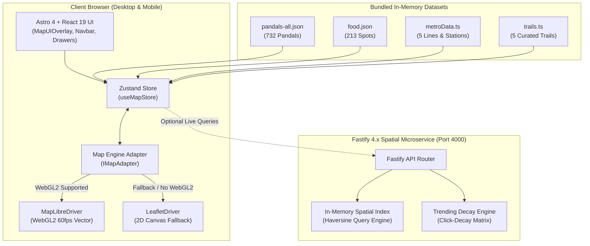

# 🎪 PUJO ATLAS (পুজো অ্যাটলাস)
### *কলকাতার সেরা দুর্গোৎসব পরিক্রমা — Kolkata, mapped through its Durga Puja*

[](https://astro.build)
[](https://react.dev)
[](https://www.typescriptlang.org)
[](https://maplibre.org)
[](https://tailwindcss.com)
[](https://zustand-demo.pmnd.rs)
[](https://fastify.dev)

**Pujo Atlas** is an editorial, mobile-first, high-performance geospatial discovery engine and cultural directory for Kolkata Durga Puja. It maps **732 verified pandals**, **213 heritage food spots**, **5 Kolkata Metro lines**, **curated walking trails**, and an **algorithmic shortest-path route planner** with sub-15ms spatial queries and 60fps hardware-accelerated vector mapping.

---

## 📑 Table of Contents

1. [System Architecture](#-system-architecture)
2. [Current Features Overview](#-current-features-overview)
3. [Pandals Dataset & Regional Statistics](#-pandals-dataset--regional-statistics)
4. [Color Codes & Strict Design Tokens](#-color-codes--strict-design-tokens)
5. [Iconography & Shape-Differentiated Markers](#-iconography--shape-differentiated-markers)
6. [Data Files & Project Structure](#-data-files--project-structure)
7. [State Management & Event Bus](#-state-management--event-bus)
8. [Map Engine Dual-Driver Architecture](#-map-engine-dual-driver-architecture)
9. [Developer Guide: How to Change Any and Everything](#-developer-guide-how-to-change-any-and-everything)
   - [Add or Edit a Pandal](#1-how-to-add-or-edit-a-pandal)
   - [Add or Edit a Food Spot](#2-how-to-add-or-edit-a-food-spot)
   - [Add or Modify a Curated Trail](#3-how-to-add-or-modify-a-curated-trail)
   - [Change Design Tokens or Colors](#4-how-to-change-design-tokens-or-colors)
   - [Customize Map Tiles or Zoom Caps](#5-how-to-customize-map-tiles-or-zoom-caps)
   - [Update Translations (Bengali / English)](#6-how-to-update-translations-bengali--english)
   - [Modify Markers or Icon Geometry](#7-how-to-modify-markers-or-icon-geometry)
   - [Run Server & Enrichment Pipelines](#8-how-to-run-server--enrichment-pipelines)
10. [Local Setup & Deployment](#-local-setup--deployment)

---

## 🏛️ System Architecture



---

## ✨ Current Features Overview

| Feature | Description | File / Location |
| :--- | :--- | :--- |
| **60fps Vector Map** | Hardware-accelerated vector map styled with custom Carto/OSM raster layer, brightness/contrast filtering for day/night, and dynamic pitch & bearing. | [`src/lib/map/MapLibreDriver.ts`](src/lib/map/MapLibreDriver.ts) |
| **Leaflet 2D Fallback** | Automated capability detection (`isWebGL2Available()`) that transparently falls back to Leaflet on legacy or low-power devices. | [`src/lib/map/LeafletDriver.ts`](src/lib/map/LeafletDriver.ts) |
| **732 Pandal Directory** | Instant debounced search by name, locality, address, or metro station, with live count badges and zero empty states. | [`src/components/views/ExploreView.tsx`](src/components/views/ExploreView.tsx) |
| **Shape-Differentiated Markers** | WCAG 2.2 AA compliant pins differentiated by shape (Star for Featured, Arch for Heritage, Flame for Trending, Bookmark for Saved). | [`src/lib/bonediIcons.ts`](src/lib/bonediIcons.ts) |
| **Floating Map Layer Island** | Prominent top-right floating island toggling **Metro Lines** (`🚇`) and **Food Spots** (`🍽️`) with live pulsing indicators. | [`src/components/views/ExploreView.tsx`](src/components/views/ExploreView.tsx) |
| **Kolkata Metro Network** | Fully mapped 5 lines (Blue Line 1, Green Line 2, Purple Line 3, Orange Line 6, Yellow Line 4) with clickable station icons. | [`src/data/metroData.ts`](src/data/metroData.ts) |
| **213 Curated Food Spots** | Heritage cabins, iconic street food, sweet shops, dhabas, and late-night biryani spots with famous items and open hours. | [`src/components/views/FoodView.tsx`](src/components/views/FoodView.tsx) |
| **Curated Puja Trails** | 5 signature walking/driving routes with distance, estimated hours, and food stops. | [`src/data/trails.ts`](src/data/trails.ts) |
| **Shortest-Path Route Optimizer** | Traveling Salesperson Problem (TSP) nearest-neighbor algorithm solving multi-stop routes with 1-tap Google Maps export. | [`src/lib/geoUtils.ts`](src/lib/geoUtils.ts), [`PlannerView.tsx`](src/components/views/PlannerView.tsx) |
| **My Puja Dashboard** | Offline-capable personal itinerary: saved favorites, visited checklist with progress bar, and route management. | [`src/components/views/MyPujaView.tsx`](src/components/views/MyPujaView.tsx) |
| **Dual Theme ("Raat" & "Din")** | "Raat" (Night pandal mode, dark base `#16100E`) as default, and "Din" (Day shola mode `#FAF6F1`). | [`src/styles/tokens.css`](src/styles/tokens.css) |
| **Bilingual i18n (বাংলা / EN)** | Full Bengali script and English internationalization across all components and filters. | [`src/lib/i18n.ts`](src/lib/i18n.ts) |
| **Collapsible Sidebar** | Claude-style expandable sidebar with `Ctrl+B` keyboard shortcut and floating expand button. | [`src/components/views/ExploreView.tsx`](src/components/views/ExploreView.tsx) |
| **Thumb-Zone Map Controls** | Compact 32px × 32px zoom, compass bearing, and geolocation controls pinned to bottom-right with mobile bottom-bar clearance. | [`src/styles/tokens.css`](src/styles/tokens.css) |

---

## 📍 Pandals Dataset & Regional Statistics

The application bundles **732 verified Durga Puja pandals** in [`src/data/pandals-all.json`](src/data/pandals-all.json).

### Regional Breakdown

| Zone Code | Region Name | Bengali Name | Pandal Count | Zone Identity Color |
| :--- | :--- | :--- | :--- | :--- |
| `SOUTH` | South Kolkata | দক্ষিণ কলকাতা | **335** | `#B8892F` (Ochre Brass) |
| `NORTH` | North Kolkata | উত্তর কলকাতা | **160** | `#4A6A8A` (Slate Indigo) |
| `EAST` | East / Salt Lake | পূর্ব কলকাতা ও সল্টলেক | **113** | `#4F8A83` (Muted Teal) |
| `HOWRAH` | Howrah | হাওড়া | **65** | `#7E5A7E` (Deep Plum) |
| `OTHERS` | Greater Kolkata / Suburbs | বৃহত্তর কলকাতা | **40** | `#C25953` (Coral Terracotta) |
| `CENTRAL` | Central Kolkata | মধ্য কলকাতা | **19** | `#B5513A` (Terracotta Brick) |
| **TOTAL** | **Entire Kolkata Metropolitan** | **সমগ্র কলকাতা** | **732** | — |

- **Mapped on Vector Canvas**: **627 pandals** have precise GPS coordinates (`lat`, `lng`).
- **Heritage Pandals (`isHeritage: true`)**: **412 pandals** founded over 75 years ago (milestones: 75+, 100+, 150+, 200+ years).
- **Featured Pandals (`isFeatured: true`)**: **30 iconic pujas** selected as editor's picks.
- **Outbound Navigation**: All 732 pandals feature pre-computed, verified Google Maps deep links.

### Canonical Pandal Schema (`PandalEntity`)

```typescript
export interface PandalEntity {
  id: string;                     // Unique kebab-case slug (e.g. 'bagbazar-sarbojanin')
  name: string;                   // English display name
  bngName?: string;               // Bengali script name (e.g. 'বাগবাজার সর্বজনীন')
  zone: Zone;                     // 'NORTH' | 'SOUTH' | 'CENTRAL' | 'EAST' | 'HOWRAH' | 'OTHERS' | 'WEST'
  address: string;                // Street address with Kolkata PIN code
  lat: number;                    // Latitude in WGS84 (e.g. 22.6028)
  lng: number;                    // Longitude in WGS84 (e.g. 88.3662)
  nearestMetro?: string;          // Metro station text (e.g. 'Shyambazar / Shobhabazar')
  nearestMetroStationId?: string; // Station ID slug (e.g. 'station-shyambazar')
  established?: number;           // Foundation year (e.g. 1919)
  heritageAge?: number;           // Current age in years (calculated from established)
  isHeritage?: boolean;           // True if established <= 1951 (>75 years)
  isFeatured?: boolean;           // True for top 30 crowd pullers / editor's picks
  isFamous?: boolean;             // True for mega-crowd landmarks
  rating?: number;                // Score out of 5.0 (e.g. 4.8)
  crowdLevel?: 'low' | 'med' | 'high'; // Real-time estimated crowd density
  categories?: string[];          // Tags: 'theme-based', 'traditional', 'famous-for-lighting'
  tags?: string[];                // Search keywords
  themeDescription?: string;      // Curated editorial background or theme synopsis
  googleMapsUrl?: string;         // Verified direct link to Google Maps
}
```

---

## 🎨 Color Codes & Strict Design Tokens

The application follows a locked analogous **42° Hue Arc (3° → 46°)** design system. Pure black (`#000000`) and uncalibrated greys are strictly prohibited.

### 1. Primary Hue Arc Tokens

| Token Name | Hex Code | Hue Angle | Role & Visual Usage |
| :--- | :--- | :--- | :--- |
| `--sindoor` | `#9E2B25` | 3° | Dark anchor text, primary buttons, major CTA backgrounds |
| `--kumkum` | `#C8432E` | 9° | Primary action, active filter chips, selected tabs |
| `--terracotta` | `#A85B3C` | 18° | Secondary surfaces, borders, Food spots layer, Heritage cards |
| `--marigold` | `#E8961E` | 36° | Accent ONLY: Featured star badges, active glowing rings, highlights |
| `--haldi` | `#C9A227` | 46° | Hairline rules, Heritage arch badges, medium crowd indicator |

### 2. Sanctioned Cool Note (<5% screen area)

| Token Name | Hex Code | Cultural Justification | Role & Visual Usage |
| :--- | :--- | :--- | :--- |
| `--neel` | `#1E3A5F` | Bengal's historical indigo dye heritage | Saved bookmark markers, Metro Line toggles, verified info states |

### 3. Neutrals (Desaturated Terracotta)

| Token Name | Hex Code | Usage |
| :--- | :--- | :--- |
| `--shola` | `#FAF6F1` | Page background in light mode (resembles traditional Sholapith white) |
| `--paper` | `#F3EBE1` | Card backgrounds, sheet surfaces, search bars (light mode) |
| `--sand` | `#DFD2C2` | 1px dividers, card borders, subtle separators |
| `--smoke` | `#8B7E73` | Secondary text, captions (guarantees 4.6:1 WCAG AA contrast on Shola) |
| `--ink` | `#241C19` | Primary headings, readable text in light mode (warm charcoal black) |

### 4. Dark Mode Tokens ("Raat" Theme — Primary Night Pandal Mode)

Activated when `data-theme="raat"` (default):

| Token Name | Hex Code | Role |
| :--- | :--- | :--- |
| `--base` | `#16100E` | Main application background (warm deep charcoal) |
| `--surface` | `#211A17` | Card surfaces, collapsible sidebar, bottom sheets |
| `--raised` | `#2C2320` | Modals, floating islands, popovers |
| `--line` | `#3A2F2A` | High-contrast subtle borders and dividers |
| `--text` | `#F3EBE3` | Primary body text (ultra-high contrast on `--base`) |
| `--text-muted` | `#A2958B` | Secondary text, ratings, addresses |
| `--kumkum-lit` | `#E8593F` | High-visibility active red (5.3:1 contrast ratio) |
| `--marigold-lit`| `#F2A93B` | High-visibility gold accent (9.4:1 contrast ratio) |

### 5. Kolkata Metro Line Colors

| Metro Line | Identity Hex | Corridor | Key Stations |
| :--- | :--- | :--- | :--- |
| **Blue Line (Line 1)** | `#38BDF8` | North - South | Dakshineswar ↔ Kavi Subhash (via Shyambazar, Esplanade, Kalighat) |
| **Green Line (Line 2)** | `#22C55E` | East - West | Howrah Maidan ↔ Salt Lake Sector V (underwater Hooghly tunnel) |
| **Purple Line (Line 3)**| `#C084FC` | Southwest | Joka ↔ Majerhat |
| **Orange Line (Line 6)**| `#FB923C` | East Bypass | Kavi Subhash (New Garia) ↔ Beleghata (Airport corridor) |
| **Yellow Line (Line 4)**| `#FACC15` | North Corridor | Noapara ↔ Airport Link |

### 6. Bonedi Regional Zone Palette

| Zone | Hex Code | Name | Description |
| :--- | :--- | :--- | :--- |
| `NORTH` | `#4A6A8A` | Slate Indigo | Bagbazar, Sovabazar, Kumartuli, Shyambazar |
| `SOUTH` | `#B8892F` | Ochre Brass | Gariahat, Ballygunge, Mudiali, Kalighat |
| `CENTRAL` | `#B5513A` | Terracotta Brick | College Square, Bowbazar, Santosh Mitra Sq |
| `EAST` | `#4F8A83` | Muted Teal | Salt Lake Blocks, Lake Town, Sreebhumi |
| `HOWRAH` | `#7E5A7E` | Deep Plum | Howrah Maidan, Salkia, Shibpur, Andul |
| `OTHERS` | `#C25953` | Coral Terracotta | Baranagar, Ariadaha, Behala, Sonarpur |

### 7. Crowd Matrix Status Colors

- **Low Crowd (`--crowd-low`)**: `#4E7852` (Forest Green)
- **Medium Crowd (`--crowd-med`)**: `#C9A227` (Haldi Amber)
- **High / Peak Crowd (`--crowd-high`)**: `#C8432E` (Kumkum Red)

---

## 🛡️ Iconography & Shape-Differentiated Markers

Markers are differentiated by **GEOMETRIC SHAPE** in addition to color to comply with WCAG 2.2 AA accessibility standards for color-blind users:

```
    [ CIRCLE + FLAME ]        [ HEXAGON + STAR ]        [ ARCH + COLONNADE ]        [ SHIELD + RIBBON ]
       Trending Pin              Featured Pin               Heritage Pin                Saved Pin
       Fill: #C8432E             Fill: #E8961E              Fill: #C9A227               Fill: #1E3A5F
```

| Marker Type | Shape & Glyph | Color | SVG Function | Purpose |
| :--- | :--- | :--- | :--- | :--- |
| **Trending** | Circle Pin with Flame Glyph | `#C8432E` (`--kumkum`) | `trendingSvg()` | High real-time navigation velocity |
| **Featured** | Hexagonal Pin with Star Glyph | `#E8961E` (`--marigold`) | `featuredSvg()` | Top 30 Editor's Picks & mega attractions |
| **Heritage** | Arched Gate Pin with Colonnade Glyph | `#C9A227` (`--haldi`) | `heritageSvg()` | Historic pujas (>75 years old, Rajbaris) |
| **Saved** | Shield Pin with Bookmark Ribbon | `#1E3A5F` (`--neel`) | `savedSvg()` | User's bookmarked favorite pandals |
| **Standard Pandal**| Traditional *Bangla Chala* Temple Arch | Zone Color | `pandalSvg(color)` | General verified pandals |
| **Food Spot** | Steaming *Katori* Bowl Badge | `#A85B3C` (Terracotta) | `foodSvg(color)` | 213 curated dining spots |
| **Metro Station** | Rounded Square Train Sign | `#1E3A5F` (Indigo) | `metroSvg(color)` | Kolkata metro stations |

All icons in the user interface use **Lucide React** configured strictly with `strokeWidth={1.5}` for a clean, consistent aesthetic.

---

## 📁 Data Files & Project Structure

```text
pujo-atlas/
├── public/                       # Static public assets, favicon, PWA icons
├── data/
│   └── templates/
│       └── curation_sheet.md     # Contribution template for scouts & users
├── server/                       # Fastify spatial backend (Port 4000)
│   ├── index.ts                  # Server entry, CORS, compression, healthcheck
│   ├── lib/
│   │   ├── data-loader.ts        # In-memory index of 732 pandals & 213 food spots
│   │   └── trending.ts           # Half-life decay algorithm for live clicks
│   └── routes/
│       ├── pandals.ts            # GET /api/pandals, GET /api/pandals/:id
│       ├── food.ts               # GET /api/food, GET /api/food/:id
│       ├── nearby.ts             # GET /api/nearby?lat=...&lng=...&radius=...
│       └── navigate.ts           # POST /api/navigate (click telemetry & deep link)
├── scripts/                      # Data maintenance & enrichment scripts
│   ├── places_enrichment.js      # Google Places API geocoder & hours fetcher
│   └── reddit_curation.py        # PRAW Reddit crowd sentiment crawler
├── src/
│   ├── components/
│   │   ├── MapUIOverlay.tsx      # Main overlay layout connecting UI to map canvas
│   │   ├── cards/
│   │   │   ├── PandalCard.tsx    # Card with establishment year, crowd, tags, directions
│   │   │   ├── PandalModal.tsx   # Detailed modal with full history, transit, hours
│   │   │   ├── FoodCard.tsx      # Card for dining spots with famous dishes
│   │   │   └── NearbyLinks.tsx   # Nearby transit and metro station links
│   │   ├── common/
│   │   │   ├── EmptyState.tsx    # Empty state illustrations with filter reset
│   │   │   └── PandalCardSkeleton.tsx # Shimmer skeleton loading cards
│   │   ├── modals/
│   │   │   └── SocialShareModal.tsx # WhatsApp, Telegram, and copy link share sheet
│   │   ├── navigation/
│   │   │   ├── Navbar.tsx        # Top brand bar, language, theme, locate me, tabs
│   │   │   └── MobileBottomNav.tsx # 6-tab mobile bottom navigation bar
│   │   └── views/
│   │       ├── ExploreView.tsx   # Map + collapsible sidebar + floating layer island
│   │       ├── DiscoverView.tsx  # Editor's picks, themes, golden crowd windows
│   │       ├── HeritageView.tsx  # Bonedi baris, rajbari history, age milestones
│   │       ├── FoodView.tsx      # 213 food spots grouped by categories & zones
│   │       ├── PlannerView.tsx   # Curated trails + TSP multi-stop route planner
│   │       └── MyPujaView.tsx    # Bookmarked pandals, visited check-in tracker
│   ├── data/
│   │   ├── pandals-all.json      # Master dataset of 732 pandals
│   │   ├── pandals-north.json    # Regional slice: North Kolkata (160)
│   │   ├── pandals-south.json    # Regional slice: South Kolkata (335)
│   │   ├── pandals-central.json  # Regional slice: Central Kolkata (19)
│   │   ├── pandals-east.json     # Regional slice: East / Salt Lake (113)
│   │   ├── pandals-west.json     # Regional slice: Howrah & Suburbs (65)
│   │   ├── food.json             # 213 curated heritage food spots
│   │   ├── metro-lines.geojson   # Raw GeoJSON line strings for Kolkata Metro
│   │   ├── metroData.ts          # Parsed metro features with line identity colors
│   │   ├── zones.geojson         # Polygon boundaries for zone highlight & dimming
│   │   └── trails.ts             # 5 signature walking and driving trails
│   ├── lib/
│   │   ├── bonediIcons.ts        # SVG marker glyph generation & MapLibre sprite loader
│   │   ├── bonediMapSkin.ts      # Canvas chalchitra arch pins & zone colors
│   │   ├── geoUtils.ts           # Haversine distance, walking time, TSP route solver
│   │   ├── i18n.ts               # Complete Bengali & English translations dictionary
│   │   ├── navigation.ts         # Google Maps outbound deep link generator
│   │   ├── schemas.ts            # Zod validation schemas & TypeScript types
│   │   ├── telemetry.ts          # Client-side event tracking dispatcher
│   │   └── map/
│   │       ├── MapEngineAdapter.ts # Abstract IMapAdapter interface & factory
│   │       ├── MapLibreDriver.ts   # WebGL2 driver with raster filter & overzooming
│   │       ├── LeafletDriver.ts    # 2D canvas fallback driver
│   │       ├── clustering.ts       # Supercluster spatial point cluster builder
│   │       └── initMap.ts          # Map initialization and store subscription
│   ├── store/
│   │   └── useMapStore.ts        # Zustand state store with LocalStorage persistence
│   ├── styles/
│   │   └── tokens.css            # Strict 42° hue arc design tokens & reset rules
│   └── pages/
│       └── index.astro           # Root HTML entrypoint loading MapLibre & CSS
├── tailwind.config.mjs           # Tailwind configuration mapped to CSS tokens
├── _astro.config.mjs             # Astro bundler configuration
└── package.json                  # Scripts and dependencies
```

---

## ⚡ State Management & Event Bus

State is managed via **Zustand** in [`src/store/useMapStore.ts`](src/store/useMapStore.ts) and synchronized with the map canvas via reactive subscriptions and a custom window Event Bus.

### LocalStorage Persistence Keys

| Key Name | Type | Purpose |
| :--- | :--- | :--- |
| `pujo_atlas_saved` | `string[]` | Array of bookmarked pandal IDs |
| `pujo_atlas_visited` | `string[]` | Array of checked-in visited pandal IDs |
| `pujo_atlas_route` | `string[]` | Array of custom itinerary pandal IDs |
| `pujo_atlas_lang` | `'en' \| 'bn'` | Persisted language preference |

### Custom Event Bus

| Event Name | Dispatch Signature | Listener / Handled In |
| :--- | :--- | :--- |
| `map:flyToPandal` | `CustomEvent<{ lat: number; lng: number }>` | Map flies camera to pandal coordinates with smooth easing. |
| `map:themeChange` | `CustomEvent<{ theme: 'din' \| 'raat' }>` | Toggles raster tile brightness, contrast, and saturation. |
| `map:locateUser` | `CustomEvent<void>` | Triggers device GPS geolocation and pans map to user. |

---

## 🗺️ Map Engine Dual-Driver Architecture

The map engine uses the **Adapter Design Pattern** via `IMapAdapter` defined in [`src/lib/map/MapEngineAdapter.ts`](src/lib/map/MapEngineAdapter.ts).

### 1. MapLibreDriver (Primary — WebGL2)
- Hardware-accelerated 60fps rendering using MapLibre GL JS.
- CartoDB Dark Matter / OSM raster tile base with dynamic filter styling:
  - **Raat Mode**: `brightness-min: 0.1`, `brightness-max: 0.72`, `contrast: 0.2`, `saturation: -0.65`.
  - **Din Mode**: `brightness-min: 0.0`, `brightness-max: 1.0`, `contrast: 0.0`, `saturation: 0.0`.
- Native overzooming up to zoom level 21 without grey missing tile errors.
- Dynamic clustering at zooms 0–12; expands to custom shape-differentiated vector pins at zoom 12+.

### 2. LeafletDriver (Fallback — 2D Canvas)
- Automatically initialized if `isWebGL2Available()` returns `false` (e.g. low-memory devices, older mobile browsers, WebGL disabled).
- Tile layer configured with `maxZoom: 21` and `maxNativeZoom: 16` to gracefully stretch raster tiles when zoomed in.
- Mirrored feature parity: renders identical pins, metro lines, zone polygons, and click handlers.

---

## 🛠️ Developer Guide: How to Change Any and Everything

### 1. How to Add or Edit a Pandal

1. Open [`src/data/pandals-all.json`](src/data/pandals-all.json).
2. To edit an existing pandal, search by `id` or `name`.
3. To add a new pandal, append an object following the schema:
   ```json
   {
     "id": "my-new-pandal-slug",
     "name": "My New Pandal Name",
     "bngName": "আমার নতুন মণ্ডপ",
     "zone": "NORTH",
     "address": "12/A, Central Avenue, Kolkata 700006",
     "lat": 22.5855,
     "lng": 88.3621,
     "nearestMetro": "Girish Park",
     "established": 1948,
     "isHeritage": true,
     "isFeatured": false,
     "rating": 4.8,
     "crowdLevel": "med",
     "categories": ["theme-based", "traditional"],
     "tags": ["theme-based", "traditional"],
     "themeDescription": "An exquisite eco-friendly installation depicting ancient terracotta temples of Bengal.",
     "googleMapsUrl": "https://www.google.com/maps/search/?api=1&query=My+New+Pandal+Name+Kolkata"
   }
   ```
4. If you wish to keep regional slices in sync, also add the entry to the matching regional file (e.g. [`src/data/pandals-north.json`](src/data/pandals-north.json)).
5. Run `npm run build` to verify JSON syntax and TypeScript types.

---

### 2. How to Add or Edit a Food Spot

1. Open [`src/data/food.json`](src/data/food.json).
2. Append a new object following this structure:
   ```json
   {
     "id": "f-my-eatery",
     "name": "Paramount Cold Storage & Syrups",
     "category": "SWEETS",
     "priceRange": "BUDGET",
     "zone": "CENTRAL",
     "address": "1/1/1D, Bankim Chatterjee St, College Square, Kolkata 700073",
     "lat": 22.5746,
     "lng": 88.3639,
     "nearestMetroStationId": "station-central",
     "famousFor": ["Daab Sharbat", "Malai Sharbat"],
     "mustTryDishes": ["Special Daab Sharbat", "Kesar Malai"],
     "openHours": "11:00 AM - 10:00 PM",
     "isLateNight": false,
     "rating": 4.9
   }
   ```
3. Categories must be one of: `'RESTAURANT' | 'CAFE' | 'DHABA' | 'STREET_FOOD' | 'SWEETS'`.
4. Price ranges must be one of: `'BUDGET' | 'MID_RANGE' | 'PREMIUM'`.

---

### 3. How to Add or Modify a Curated Trail

1. Open [`src/data/trails.ts`](src/data/trails.ts).
2. Add a new trail object to the `PUJA_TRAILS` array:
   ```typescript
   {
     id: 'behala-art-walk',
     title: 'Behala Contemporary Art Walk',
     bngTitle: 'বেহালা সমকালীন শিল্প পরিক্রমা',
     tagline: '5 pandals · 3.2 km · ~2.5 hours',
     bngTagline: '৫টি মণ্ডপ · ৩.২ কিমি · ~২.৫ ঘণ্টা',
     zone: 'SOUTH',
     estimatedHours: 2.5,
     distanceKm: 3.2,
     pandalIds: ['behala-natun-dal', 'behala-club', 'barisha-club'],
     foodIds: ['f-mitra-cafe'],
     highlights: ['Experimental terracotta art installations', 'Traditional Chandannagar illumination'],
     theme: 'theme',
     coverEmoji: '🎨',
     description: 'A relaxed evening walking corridor celebrating contemporary Durga Puja art.'
   }
   ```

---

### 4. How to Change Design Tokens or Colors

1. Open [`src/styles/tokens.css`](src/styles/tokens.css).
2. Change the CSS custom property under `:root` (for light mode) or `:root[data-theme='raat']` (for dark mode).
3. If changing theme palette tokens, ensure the values align with the 42° hue arc:
   - Primary Red/Kumkum: `--kumkum`
   - Secondary Terracotta: `--terracotta`
   - Accent Marigold: `--marigold`
   - Neutral Backgrounds: `--shola` (light) / `--base` (dark)
4. Check [`tailwind.config.mjs`](tailwind.config.mjs) if you want to expose new utility classes in Tailwind.

---

### 5. How to Customize Map Tiles or Zoom Caps

#### In MapLibre (`MapLibreDriver.ts`):
- To change the max zoom level:
  ```typescript
  // Around line 60 in src/lib/map/MapLibreDriver.ts
  this.map = new maplibregl.Map({
    container,
    style: '...',
    maxZoom: 18, // Adjust maximum allowed user zoom
  });
  ```
- To customize the OSM/Carto tile layer URL:
  Search for `osm-streets-tiles` around line 95 in [`src/lib/map/MapLibreDriver.ts`](src/lib/map/MapLibreDriver.ts).

#### In Leaflet (`LeafletDriver.ts`):
- To change tile source or attribution:
  Update `TILE_URL` and `TILE_ATTRIBUTION` at lines 6–8 in [`src/lib/map/LeafletDriver.ts`](src/lib/map/LeafletDriver.ts).
- Notice `maxNativeZoom: 16` prevents missing tile grey placeholders by stretching tiles past zoom 16.

---

### 6. How to Update Translations (Bengali / English)

1. Open [`src/lib/i18n.ts`](src/lib/i18n.ts).
2. Locate the key inside the `DICTIONARY` object.
3. Add or update the string:
   ```typescript
   export const DICTIONARY = {
     filters: {
       myNewFilter: { en: 'Eco Pandals', bn: 'পরিবেশ-বান্ধব মণ্ডপ' },
     }
   };
   ```
4. Access the translation in any React component via:
   ```typescript
   import { t } from '../../lib/i18n';
   // Inside component:
   <span>{t('filters.myNewFilter', language)}</span>
   ```

---

### 7. How to Modify Markers or Icon Geometry

1. Open [`src/lib/bonediIcons.ts`](src/lib/bonediIcons.ts).
2. Marker SVG templates are generated as pure SVG strings:
   - `trendingSvg()`: Flame pin
   - `featuredSvg()`: Star pin
   - `heritageSvg()`: Arch pin
   - `savedSvg()`: Bookmark pin
   - `pandalSvg(fill)`: Base chalchitra arch
   - `foodSvg(fill)`: Katori steaming bowl
   - `metroSvg(fill)`: Rounded train sign
3. When modifying SVG code:
   - Keep viewBox proportional (e.g. `0 0 48 58`).
   - Retain the `stroke="#241C19"` dark outline to guarantee marker visibility against any background map tile.

---

### 8. How to Run Server & Enrichment Pipelines

- **Start Fastify Spatial Backend:**
  ```bash
  npm run dev:api
  ```
  Runs on `http://localhost:4000`. Endpoints:
  - `GET /health`
  - `GET /api/pandals`
  - `GET /api/food`
  - `GET /api/nearby?lat=22.57&lng=88.36&radius=3`
  - `POST /api/navigate`

- **Enrich Coordinates via Google Places API:**
  ```bash
  export GOOGLE_PLACES_API_KEY="your-api-key"
  node scripts/places_enrichment.js
  ```

- **Run Reddit Crowd Sentiment Scraper:**
  ```bash
  export REDDIT_CLIENT_ID="your-client-id"
  export REDDIT_CLIENT_SECRET="your-client-secret"
  python scripts/reddit_curation.py
  ```

---

## 🚀 Local Setup & Deployment

### Prerequisites
- Node.js version **18.x** or **20.x**
- npm, pnpm, or yarn

### 1. Installation
```bash
git clone https://github.com/asg-7/PujoAtlas.git
cd PujoAtlas
npm install
```

### 2. Run Development Server
```bash
# Runs both Astro frontend (port 4321) and Fastify API (port 4000)
npm run dev

# Or run frontend only:
npm run dev:web
```

### 3. Production Build & Verification
```bash
# Runs Astro build and TypeScript type-checking
npm run build
```

### 4. Deploying
- **Netlify**: Pre-configured via `netlify.toml` for static CDN hosting with Edge Functions.
- **Vercel**: Pre-configured via `vercel.json`.
- **Node Server (Self-Hosted / VPS / Docker)**: Run `npm run build` and start `node server/index.ts`.

---

## 📜 License & Credits

- **Curated By**: Pujo Atlas Editorial & Tech Collective.
- **Data Sources**: Forum for Durgotsab (FFD), West Bengal Tourism, Kolkata Police Traffic advisories, and crowdsourced volunteers.
- **Map Data**: © [MapLibre](https://maplibre.org), © [CARTO](https://carto.com), © [OpenStreetMap](https://osm.org/copyright) contributors, © [Esri](https://www.esri.com).
- **Typography**: *Noto Serif Bengali*, *EB Garamond*, *Inter*, and *Karla*.
- **License**: MIT License. Feel free to fork, customize, and celebrate Kolkata Durga Puja!
